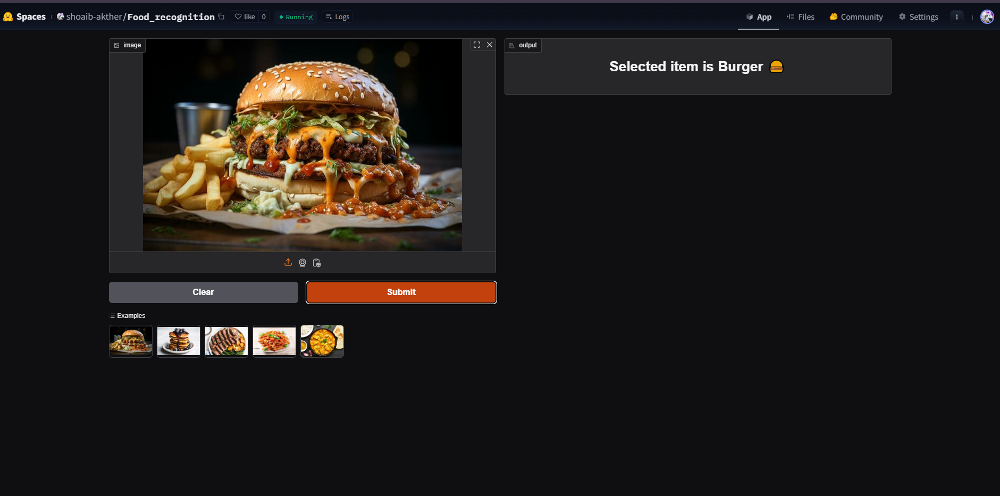

# Quick-Dish-Detection | Image Recognition  

An end-to-end image classification project covering data collection, preprocessing, model training, deployment, and API integration. Leveraging a dataset of over 5000 images, this project utilizes advanced image recognition techniques to classify and detect 25 distinct food categories with high accuracy.  

## 🍽️ Food Categories  
The model can recognize the following food items:  
1. 🍖 BBQ Ribs
2. 🍔 Burger
3. 🍰 Cheesecake
4. 🍛 Curry
5. 🍩 Donut
6. 🥟 Dumplings
7. 🍗 Fried Chicken
8. 🍟 Fries
9. 🌭 Hot Dog
10. 🍦 Ice Cream
11. 🍜 Noodles
12. 🍳 Omelette
13. 🥞 Pancakes
14. 🍝 Pasta
15. 🍕 Pizza
16. 🍚 Rice Dish
17. 🥗 Salad
18. 🥪 Sandwich
19. 🥤 Smoothie
20. 🍲 Soup
21. 🥩 Steak
22. 🍛 Stew
23. 🍣 Sushi
24. 🌮 Taco
25. 🧇 Waffles

## 📂 Dataset Preparation  

### 👅 Data Collection  
- Images were scraped from **DuckDuckGo** using search queries corresponding to food item names.

### 📦 DataLoader  
- The **FastAI DataBlock API** was utilized to efficiently create and manage data loaders.  

### 🎨 Data Augmentation  
- Default **GPU-accelerated** data augmentation techniques from FastAI were applied for improved generalization.  

🔍 More details can be found in [`notebooks/data_cleaning.ipynb`](notebooks/data_cleaning.ipynb).  

---

## 🏅 Model Training & Data Cleaning  

### 🏆 Training  
- Fine-tuned a **ResNet34** model over **3 epochs (twice)** achieving approximately **90% accuracy**.  

### 🖌️ Data Cleaning  
- The dataset contained significant noise as it was collected from the web.  
- Used **FastAI ImageClassifierCleaner** for interactive data cleaning.  
- Data cleaning was performed **after each training iteration**, ensuring high-quality inputs for subsequent refinements.  

---

## 🚀 Model Deployment  

- The trained model was deployed on **Hugging Face Spaces** using **Gradio**.  
- The implementation can be found in the `deployment` folder.  
- Live demo available here: [Hugging Face Deployment](https://huggingface.co/spaces/shoaib-akther/Food_recognition).  

📸 **Preview of Gradio App:**  
  

---

## 🌐 API Integration with GitHub Pages  

- The deployed model's API is integrated into a **GitHub Pages** website.  
- Visit the live web app here: **[GitHub Pages Link](https://shoaib-akther-asif.github.io/Capstone-project---Image-Detect/)**.  
- Implementation details are available in the `docs` folder.  

---

### 🔗 Additional Resources  

- **Trained Model:** [Download Here](https://drive.google.com/drive/folders/1XpBUckWP76DLaWytmuNJY2y0LfK6p9Ag?usp=sharing) (`.pkl` format).  
  - The final model used: `food-recognizer-v1.pkl`.  
- **Data Loaders:** [Access Here](https://drive.google.com/drive/folders/1YOTuRQ_DVUiIyFh5lVUsYZe6LMfUu6xa?usp=sharing).  
- **Data:** [Access Here](https://drive.google.com/drive/folders/1-2NUtarvn3mOdojgN-ooQTKpYA8cVgEX?usp=sharing).
---

### 🛠️ How to Use  

1. Clone the repository:  
   ```bash
   git clone https://github.com/Shoaib-Akther-Asif/Capstone-project---Image-Detect.git
   ```
2. Install dependencies:  
   ```bash
   pip install -r requirements.txt
   ```
3. Run the Gradio app locally:  
   ```bash
   python app.py
   ```
4. Access the API on [GitHub Pages here](https://github.com/Shoaib-Akther-Asif/Capstone-project---Image-Detect).  

--- 
